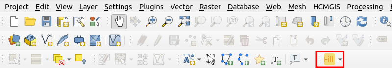

# Blender-Addon-Photogrammetry-Importer

Adds a button which modifies the render properties of each (selected) geojson
layer. Instead of the default rendering option the "fill" property of each
layer is used to display the layer.


## Installation
* cd `QGIS-Plugin-Geojson-Filling/geojson_filling`
* install `pb_tool` with `pip install pb_tool`
* Run `pb_tool zip` which creates
```
├── QGIS-Plugin-Geojson-Filling/geojson_filling/zip_build
│   ├── geojson_filling
│   ├── geojson_filling.zip
│   ├── !README.txt
```
* In `QGIS` go to `Plugins/Manage and Install Plugins ...`, click on
  `Install from ZIP`, and select `QGIS-Plugin-Geojson-Filling/geojson_filling/zip_build/geojson_filling.zip`.
* Afterwards you find the plugin in one of the top toolbars of QGIS - see the
  red rectangle in the image below.
  

## Usage


## Plugin Development
Instruction for plugin development are provided [here](doc/plugin_development.md).
