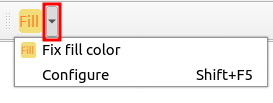
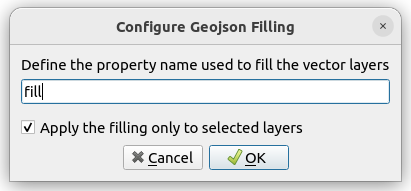

# QGIS-Plugin-Geojson-Filling

Motivation: When opening a geojson file in QGIS, a random color is assigned.
While it is possible to use specific geojson properties to replace the default
(random) color, this becomes a tedious for large number of files.

This plugin allows to set the color of a set of geojson files with a single
click.

Official page of the plugin in the QGIS plugin repository: []()

## Installation from Release
* Download a release from the [QGIS Plugin repository](https://plugins.qgis.org/plugins/geojson_filling/) or the [Github release page](https://github.com/SBCV/QGIS-Plugin-Geojson-Filling/releases) (`geojson_filling.zip`).
* In `QGIS` go to `Plugins/Manage and Install Plugins ...`, click on
  `Install from ZIP`, and select the `geojson_filling.zip` file.
* Afterwards you find the plugin in one of the top toolbars of QGIS - see the
  red rectangle in the image below.
  

## Installation from Source
* cd `QGIS-Plugin-Geojson-Filling/geojson_filling`
* install `pb_tool` with `pip install pb_tool`
* Run `pb_tool zip` which creates
```
├── QGIS-Plugin-Geojson-Filling/geojson_filling/zip_build
│   ├── geojson_filling
│   ├── geojson_filling.zip
│   ├── !README.txt
```
* Activate the plugin in QGIS as shown above (see `Installation from Release`)

## Usage
The plugin adds a button which allows to modify the rendering of all (or all
selected) vector layers (i.e. the loaded geojson files) in the current QGIS
session. Instead of the default random color, a specific property of each
geojson file is used for rendering the corresponding layer.

By default, the plugin is looking for a property named `fill` as shown in the
example below.

```json
{
    "features": [
        {
            "geometry": {
                "coordinates": [
                    [
                        [
                            13.036073975554306,
                            52.39652411784479
                        ],
                        [
                            13.03608716557477,
                            52.39651801475642
                        ],
                        [
                            13.036073975554306,
                            52.39652411784479
                        ]
                    ]
                ],
                "type": "Polygon"
            },
            "properties": {
                "fill": "#ffff00",
                "fill-opacity": 0.5
            },
            "type": "Feature"
        }
    ],
    "type": "FeatureCollection"
}
```

The name of the property may be changed using the plugin options (by clicking
on the small arrow on the right side of the icon).



Clicking on `Configure` opens the following dialog which allows to change the
property name.



By default, the filling operation is limited to the current layer selection.
This behavior can be changed in the configuration dialog shown above.

## Examples
Two example files are provided under `examples/cars.json` and
`examples/single_car.json`.

## Plugin Development
Instruction for plugin development are provided [here](doc/plugin_development.md).
